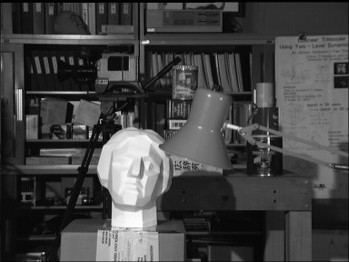
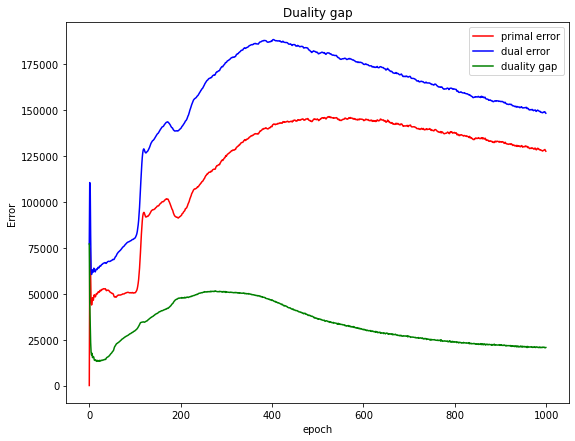

## TV-regularized Stereo Disparity in OpenCV

---

### Overview

The TV-regularized stereo disparity implementation in this repo is based on the following paper:

- Pock, Thomas, et al. "A convex formulation of continuous multi-label problems." Computer Vision–ECCV 2008: 10th European Conference on Computer Vision, Marseille, France, October 12-18, 2008, Proceedings, Part III 10. Springer Berlin Heidelberg, 2008.

**Inputs:**

<div style="text-align:center">


Image Left
</div>

<div style="text-align:center">


Image right
</div>

**Output results:**

<div style="text-align:center">



Duality gap
</div>

<div style="text-align:center">


Output disparity
</div>

---

### Dependencies

||Version|
|-|:-:|
|cmake | 3.22|
|Python| 3.8.10|
|OpenCV | 4.5.1|
|libtbb-dev | 2020.1-2|
|OpenMP| 4.5|

---

### How to build and run

```bash
$ git clone https://github.com/raymondngiam/tv-regularized-stereo-disparity-in-opencv.git
$ cd tv-regularized-stereo-disparity-in-opencv
$ mkdir build && cd build
$ cmake ..
$ make
$ make install
$ cd ../install/bin/release/
$ ./main
```

---

### Implementation Details

Let $u(x,y)$ be a vector field representing the disparity between image $I_1(x,y)$ and $I_2(x,y)$.

$$I_1(x,y) = I_2(x+u(x,y),y)$$

From here onwards, we represent the input space as vector $\mathbf{x} = \begin{bmatrix}x \\
y
\end{bmatrix}$

Let $\rho(\mathbf{x},u(\mathbf{x}))$ is a function that maps to the error function:

$$\rho(\mathbf{x},u(\mathbf{x})) = |I_1(\begin{bmatrix}x \\
y
\end{bmatrix}) - I_2(\begin{bmatrix}x + u(\mathbf{x}) \\
y
\end{bmatrix})|$$

The variational stereo disparity problem with total variation regularization is thus given by

$$\min_u \biggl\{ \int_{\Omega} \rho(\mathbf{x},u(\mathbf{x})) d\mathbf{x} + \lambda \int_{\Omega} |\nabla u(\mathbf{x})|d\mathbf{x}\biggr\}\space \space \text{(Eq. 1)}$$

where $\lambda$ is the smoothness regularization parameter.

#### Functional lifting

The key idea is to lift the original problem formulation to a higher dimensional space by representing $u$ in terms of its level sets.

Let the characteristic function $\mathbf{1}_{u>\gamma} (\mathbf{x}): \Omega \rightarrow \{0,1\} $ be the indicator for the $\gamma$ - super-levels of $u$:

$$\mathbf{1}_{u>\gamma} (\mathbf{x}) = \Bigl\{ \begin{matrix} 1 & \text{,if }u(\mathbf{x})>\gamma\\
0 & \text{otherwise.}
\end{matrix}$$

Next, we make use of the above defined characteristic functions to construct a binary function $\phi$ which resembles the graph of $u$.

Let $\phi : [\Omega \times \Gamma] \rightarrow \{0,1\}$ be a binary function defined as

$$\phi(\mathbf{x},\gamma) = \mathbf{1}_{u>\gamma} (\mathbf{x})$$

We can see that $\phi(x, \gamma_{min}) = 1$ and $\phi(x, \gamma_{max}) = 0$.
Hence, the feasible set of functions $\phi$ is given by,

$$D' = \{ \phi : [\Omega \times \Gamma] \rightarrow \{0,1\} \space | \space \phi(x, \gamma_{min}) = 1, \phi(x, \gamma_{max}) = 0 \}$$

Note that the function $u$ can be recovered from $\phi$ using the following layer cake formula,

$$u(\mathbf{x}) = \gamma_{min} + \int_{\Gamma} \phi(\mathbf{x},\gamma) d\gamma$$

The previous variational stereo disparity problem in Eq.1 can be rewritten as,

$$\min_{\phi \in D'} \biggl\{ \int_{\Omega}\int_{\Gamma} \rho(\mathbf{x},u(\mathbf{x})) |\partial_\gamma \phi(\mathbf{x},\gamma)| \space d\gamma d\mathbf{x} + \lambda \int_{\Gamma}\int_{\Omega} |\nabla_{\mathbf{x}} \phi(\mathbf{x},\gamma)|\space d\mathbf{x} d\gamma \biggr\}$$

$$\min_{\phi \in D'}  \biggl\{ \int_{\Omega}\int_{\Gamma} \biggl\{\rho(\mathbf{x},u(\mathbf{x})) |\partial_\gamma \phi(\mathbf{x},\gamma)| \space  +  \lambda |\nabla_{\mathbf{x}} \phi(\mathbf{x},\gamma)| \biggr\}\space d\mathbf{x} d\gamma \biggr\} \space \space \text{(Eq. 2)}$$

The second part (or smoothness term) of the equation above is based on the co-area formula, which essentially states that the TV norm can be decomposed into a sum of the length of the level sets of $u$.

#### Convex relaxation

Although the current formulation is convex in $\phi$, the variational problem is still non-convex since the minimization is carried out over $D'$ which is a non-convex set. 

The idea is now to relax the variational problem by allowing $\phi$ to vary smoothly in the interval $[0, 1]$. This leads to the following convex set of feasible solutions of $\phi$.

$$D = \{\phi : [\Omega \times \Gamma] \rightarrow [0,1] \space | \space \phi(\mathbf{x}, \gamma_{min}) = 1, \phi(\mathbf{x}, \gamma_{max}) = 0 \}$$

Hence the associated variational problem is now,

$$\min_{\phi \in D}  \biggl\{ \int_{\Omega}\int_{\Gamma} \biggl\{\rho(\mathbf{x},u(\mathbf{x})) |\partial_\gamma \phi(\mathbf{x},\gamma)| \space  +  \lambda |\nabla_{\mathbf{x}} \phi(\mathbf{x},\gamma)| \biggr\}\space d\mathbf{x} d\gamma \biggr\} \space \space \text{(Eq. 3)}$$

#### Discontinuity of non-smooth functions

The fundamental approach to minimize Eq. 3 is to solve its associated Euler-Lagrange differential equation.

$$E(\phi,\phi')=\int \mathcal{L}(\phi,\phi')dx$$

$$\mathcal{L}(\phi,\phi') = \rho(\mathbf{x},u(\mathbf{x})) |\partial_\gamma \phi(\mathbf{x},\gamma)| \space  +  \lambda |\nabla_{\mathbf{x}} \phi(\mathbf{x},\gamma)|$$

$$\frac{dE}{d\phi} = \frac{\partial \mathcal{L}}{\partial \phi} - \text{div}\frac{\partial \mathcal{L}}{\partial \phi'}$$

$$\frac{dE}{d\phi} = -\partial_\gamma (\rho(\mathbf{x},u(\mathbf{x}))\frac{\partial_\gamma \phi(\mathbf{x},\gamma)}{|\partial_\gamma \phi(\mathbf{x},\gamma)|}) - \lambda \space \text{div}\frac{\nabla_{\mathbf{x}} \phi(\mathbf{x},\gamma)}{|\nabla_{\mathbf{x}} \phi(\mathbf{x},\gamma)|}$$

It is easy to see that these equations are not defined either as $|\nabla_{\mathbf{x}} \phi(\mathbf{x},\gamma)| \rightarrow 0$ or $|\partial_\gamma \phi(\mathbf{x},\gamma)| \rightarrow 0$. 

In order to resolve these discontinuities, one could use regularized variants of these terms, e.g. $|\nabla_{\mathbf{x}} \phi(\mathbf{x},\gamma)|_\epsilon = \sqrt{|\nabla_{\mathbf{x}} \phi(\mathbf{x},\gamma)|^2 + \epsilon^2}$ and $|\partial_\gamma \phi(\mathbf{x},\gamma)|_\epsilon = \sqrt{|\partial_\gamma \phi(\mathbf{x},\gamma)|^2 + \epsilon^2}$, for some small constant $\epsilon$. However, for small values of $\epsilon$ the equations are still nearly degenerate and for larger values the properties of the model get lost.

To overcome the non-differentiability of the term $\rho(\mathbf{x},u(\mathbf{x}))|\partial_\gamma \phi(\mathbf{x},\gamma)|+|\nabla_{\mathbf{x}} \phi(\mathbf{x},\gamma)|$ we employ its dual formulation

$$\rho(\mathbf{x},u(\mathbf{x}))|\partial_\gamma \phi(\mathbf{x},\gamma)|+ \lambda |\nabla_{\mathbf{x}} \phi(\mathbf{x},\gamma)| \equiv \max_{\mathbf{p}} \bigg\{\mathbf{p} \cdot \nabla_3 \phi(\mathbf{x},\gamma)\bigg\} \space \text{s.t.} \space \sqrt{p_1^2 + p_2^2} \leq \lambda , \space |p_3| \leq \ \rho(\mathbf{x},\gamma)$$

where $\mathbf{p} = (p_1, p_2, p_3)^T$ is the dual variable and $\nabla_3$ is the full (three dimensional) gradient operator.

This, in turn, leads us to the following primal-dual formulation of the functional:

$$\min_{\mathbf{\phi}\in D} \bigg\{\max_{\mathbf{p}\in C} \bigg\{\int_{\Omega}\int_{\Gamma} \mathbf{p}\cdot \nabla_3 \phi(\mathbf{x},\gamma)\space d\gamma d\mathbf{x}\bigg\}\bigg\}$$

where

$$\{C : [\Omega \times \Gamma] \rightarrow \mathbb{R}^3 \space | \space \sqrt{p_1(\mathbf{x},\gamma)^2 + p_2(\mathbf{x},\gamma)^2} \leq \lambda, \space |p_3(\mathbf{x},\gamma)| \leq \rho(\mathbf{x},\gamma)\}$$

#### Primal-dual proximal steps

$$E(\phi,\phi',\mathbf{p},\mathbf{p}')=\int \mathcal{L}(\phi,\phi',\mathbf{p},\mathbf{p}')dx$$

$$\mathcal{L}(\phi,\phi'\mathbf{p},\mathbf{p}') = \mathbf{p}(\mathbf{x},\gamma)\cdot\nabla_3 \phi(\mathbf{x},\gamma)$$

$$\frac{dE}{d\phi} = \frac{\partial \mathcal{L}}{\partial \phi} - \text{div}\frac{\partial \mathcal{L}}{\partial \phi'}$$

$$\frac{dE}{d\phi} = -\text{div}_3 \mathbf{p}(\mathbf{x},\gamma)$$

$$\frac{dE}{d\mathbf{p}} = \frac{\partial \mathcal{L}}{\partial \mathbf{p}} - \text{div}\frac{\partial \mathcal{L}}{\partial \mathbf{p}'}$$

$$\frac{dE}{d\mathbf{p}} = \nabla_3 \phi(\mathbf{x},\gamma)$$

1. Primal step: For fixed $\mathbf{p}$, compute a proximal primal step for $\phi$.
    $$\phi^{k+1} = \phi^k - (-\tau_p \frac{dE}{d\phi})$$

    $$\phi^{k+1}(\mathbf{x},\gamma) = \phi^k(\mathbf{x},\gamma) + \tau_p \text{div}_3 \mathbf{p}(\mathbf{x},\gamma)$$

    Note, that the scheme does not ensure that $\phi^{k+1} \in D$. Therefore we have to reproject $\phi^{k+1}$ onto $D$ using the projection $\mathcal{P}_\phi(\phi^{k+1})$:

    $$\mathcal{P}(\phi^{k+1}) = \Bigg\{ \begin{matrix} 0 & \text{, }\phi^{k+1}(\mathbf{x},\gamma)< 0\\ 1 & \text{, }\phi^{k+1}(\mathbf{x},\gamma)> 1\\ \phi^{k+1}(\mathbf{x},\gamma) & \text{, otherwise}\end{matrix}$$

2. Dual step: For fixed $\phi$, compute a proximal dual step for $\mathbf{p}$.

    $$\mathbf{p}^{k+1} = \mathbf{p}^k + \tau_d \frac{dE}{d\mathbf{p}}$$

    $$\mathbf{p}^{k+1} = \mathbf{p}^k + \tau_d \nabla_3 \phi(\mathbf{x},\gamma)$$

    Since we need to ensure that $\mathbf{p}^{k+1} \in C$ we reproject $\mathbf{p}^{k+1}$ onto $C$ using the projections $\mathcal{P}_\mathbf{p}(\mathbf{p}^{k+1})$:

    $$\mathcal{P}_\mathbf{p}(p_1^{k+1}) = \frac{p_1^{k+1}}{\text{max}(1,\frac{\sqrt{p_1^{2}+p_2^{2}}}{\lambda})}$$

    $$\mathcal{P}_\mathbf{p}(p_2^{k+1}) = \frac{p_2^{k+1}}{\text{max}(1,\frac{\sqrt{p_1^{2}+p_2^{2}}}{\lambda})}$$

    $$\mathcal{P}_\mathbf{p}(p_3^{k+1}) = \frac{p_3^{k+1}}{\text{max}(1,\frac{|p_3|}{\rho})}$$

#### Step size
From empirical observation, the algorithm converges as long as the product $\tau_p \tau_d \leq \frac{1}{3}$. Therefore the following choice of step size was chosen:
$$\tau_p = \tau_d = \frac{1}{\sqrt{3}}$$

---

### References

- Pock, Thomas, et al. "A convex formulation of continuous multi-label problems." Computer Vision–ECCV 2008: 10th European Conference on Computer Vision, Marseille, France, October 12-18, 2008, Proceedings, Part III 10. Springer Berlin Heidelberg, 2008.